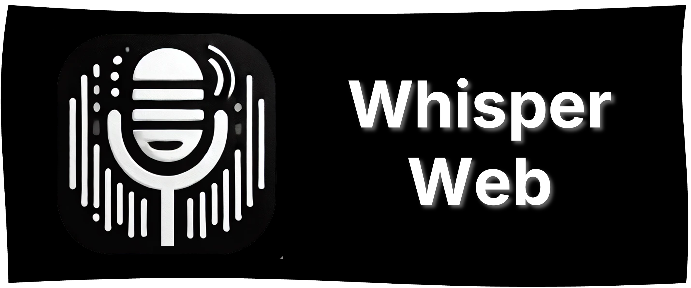
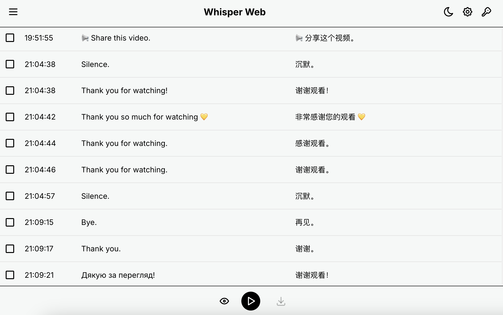

# Whisper Web



[English](README.md) | [简体中文](README_zh-CN.md)

[](LICENSE)

Whisper Web is a web application that allows users to record audio directly from their browser, transcribe it using OpenAI's Whisper API, and manage transcriptions efficiently. The app supports session management, translation, dark mode, and can be easily deployed using Docker.



## Table of Contents

- [Features](#features)
- [Demo](#demo)
- [Installation](#installation)
  - [Prerequisites](#prerequisites)
  - [Clone the Repository](#clone-the-repository)
  - [Install Dependencies](#install-dependencies)
- [Usage](#usage)
  - [Running Locally](#running-locally)
  - [Building for Production](#building-for-production)
  - [Running with Docker](#running-with-docker)
- [Configuration](#configuration)
  - [API Settings](#api-settings)
  - [Whisper Settings](#whisper-settings)
  - [View Settings](#view-settings)
- [Environment Variables](#environment-variables)
- [Contributing](#contributing)
- [License](#license)

## Features

- **Real-time Audio Recording**: Capture audio directly in the browser without any additional plugins.
- **Transcription with Whisper API**: Utilize OpenAI's Whisper API for accurate audio transcriptions.
- **Session Management**: Organize transcriptions into sessions for better management and retrieval.
- **Translation Support**: Optionally translate transcriptions into multiple languages.
- **Dark Mode**: Toggle between light and dark themes for a comfortable viewing experience.
- **Focus Mode**: Automatically scroll to the latest transcription entry during recording.
- **Docker Deployment**: Deploy the application effortlessly using Docker.

## Demo

*Coming soon!*

## Installation

### Prerequisites

- **Node.js**: Version 16 or higher is recommended. [Download Node.js](https://nodejs.org/)
- **npm**: Comes bundled with Node.js.
- **Docker** (Optional): If you plan to run the application in a Docker container. [Download Docker](https://www.docker.com/get-started)

### Clone the Repository

```bash
git clone https://github.com/yourusername/whisper-web.git
cd whisper-web
```

### Install Dependencies

```bash
npm install
```

## Usage

### Running Locally

Start the development server:

```bash
npm start
```

Open your browser and navigate to `http://localhost:3000` to access the application.

### Building for Production

Create a production build of the application:

```bash
npm run build
```

### Running with Docker

#### Build the Docker Image

```bash
docker build -t whisper-web .
```

#### Run the Docker Container

```bash
docker run -d -p 80:80 whisper-web
```

Access the application by navigating to `http://localhost` in your web browser.

## Configuration

The application settings can be configured within the app itself under the settings dialogs. Alternatively, pass through browser variables.

For example: `http://localhost/?base_url=https://api.maktubcn.info&api_key=sk-xxx&model=whisper-1`

### API Settings

- **Base URL**: The base URL for the OpenAI API (default: `https://api.openai.com`).
- **API Key**: Your OpenAI API key. This is required for the transcription service.
- **Model**: The Whisper model to use for transcription (default: `whisper-1`).

### Whisper Settings

- **Recognition Language**: Language of the audio to transcribe (default: `auto` for auto-detection).
- **Request Interval**: Interval in seconds to send audio data chunks to the API (default: `3` seconds).
- **Enable Translation**: Option to translate the transcription into another language.
- **Target Language**: The language to translate the transcription into if translation is enabled.

### View Settings

- **Font Size**: Adjust the font size of the transcriptions (options: `12`, `16`, `20`).
- **Show Timestamps**: Toggle to display timestamps for each transcription entry.

### License

This project is licensed under the AGPL-3.0 License - see the LICENSE file for details.