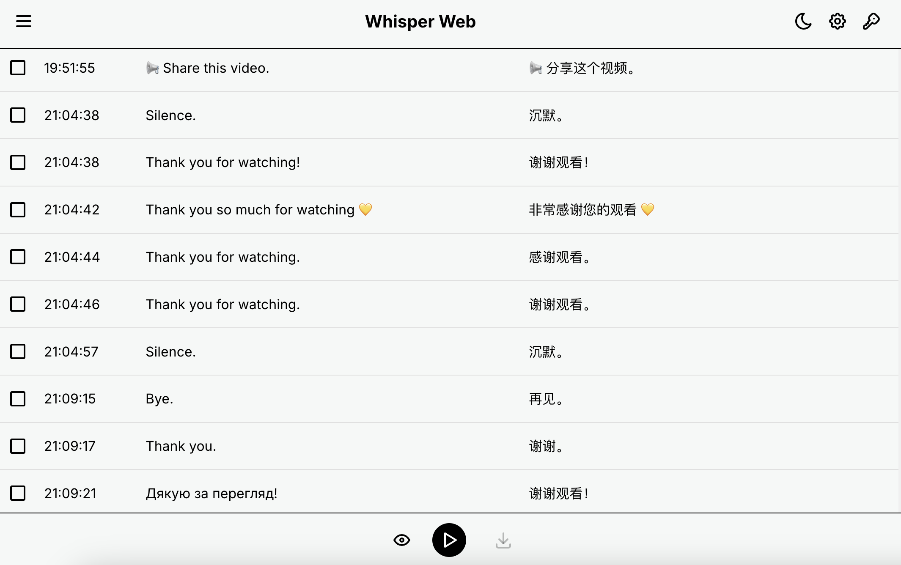

# Whisper Web


[English](README.md) | [简体中文](README_zh-CN.md)

[](LICENSE)

Whisper Web 是一款网络应用程序，允许用户直接在浏览器中录音、使用 OpenAI 的 Whisper API 转录音频，并高效地管理转录内容。该应用支持会话管理、翻译、深色模式，并可以使用 Docker 轻松部署。



## 目录

- [功能](#功能)
- [演示](#演示)
- [安装](#安装)
  - [先决条件](#先决条件)
  - [克隆仓库](#克隆仓库)
  - [安装依赖](#安装依赖)
- [使用](#使用)
  - [本地运行](#本地运行)
  - [生产构建](#生产构建)
  - [使用 Docker 运行](#使用-docker-运行)
- [配置](#配置)
  - [API 设置](#api-设置)
  - [Whisper 设置](#whisper-设置)
  - [视图设置](#视图设置)
- [环境变量](#环境变量)
- [贡献](#贡献)
- [许可证](#许可证)

## 功能

- **实时音频录制**：直接在浏览器中捕获音频，无需任何额外插件。

- **Whisper API 转录**：利用 OpenAI 的 Whisper API 进行准确的音频转录。

- **会话管理**：将转录内容组织成会话，便于管理和检索。

- **翻译支持**：可选择将转录内容翻译为多种语言。

- **深色模式**：在明暗主题间切换，提供舒适的浏览体验。

- **专注模式**：录制过程中自动滚动到最新的转录条目。

- **Docker 部署**：使用 Docker 轻松部署应用程序。

## 演示

*即将推出！*

## 安装

### 先决条件

- **Node.js**：推荐版本 16 或更高。[下载 Node.js](https://nodejs.org/)

- **npm**：随 Node.js 一起捆绑。

- **Docker**（可选）：如果计划在 Docker 容器中运行应用程序。[下载 Docker](https://www.docker.com/get-started)

### 克隆仓库

```bash
git clone https://github.com/yourusername/whisper-web.git

cd whisper-web
```

### 安装依赖

```bash
npm install
```

## 使用

### 本地运行

启动开发服务器：

```bash
npm start
```

在浏览器中打开并导航到 `http://localhost:3000` 以访问应用程序。

### 生产构建

创建应用程序的生产版本：

```bash
npm run build
```

### 使用 Docker 运行

#### 构建 Docker 镜像

```bash
docker build -t whisper-web .
```

#### 运行 Docker 容器

```bash
docker run -d -p 80:80 whisper-web
```

通过在网页浏览器中导航到 `http://localhost` 访问应用程序。

## 配置

可以在应用程序本身的设置对话框中配置应用程序设置。或者，通过浏览器变量传递。

例如：`http://localhost/?base_url=https://api.maktubcn.info&api_key=sk-xxx&model=whisper-1`

### API 设置

- **基础 URL**：OpenAI API 的基础 URL（默认：`https://api.openai.com`）。

- **API 密钥**：您的 OpenAI API 密钥。这对于转录服务是必需的。

- **模型**：用于转录的 Whisper 模型（默认：`whisper-1`）。

### Whisper 设置

- **识别语言**：要转录的音频语言（默认：`auto` 表示自动检测）。

- **请求间隔**：向 API 发送音频数据块的时间间隔（默认：`3` 秒）。

- **启用翻译**：选择将转录内容翻译为另一种语言。

- **目标语言**：如果启用翻译，则为转录内容要翻译的语言。

### 视图设置

- **字体大小**：调整转录内容的字体大小（选项：`12`、`16`、`20`）。

- **显示时间戳**：切换是否显示每个转录条目的时间戳。

## 许可证

本项目根据 AGPL-3.0 许可证授权 - 详情请参见 LICENSE 文件。